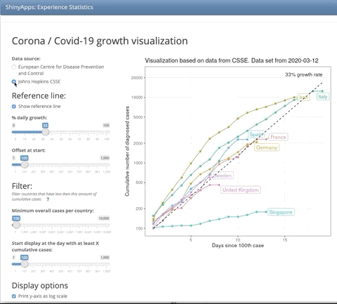

# Corona / Covid-19 growth visualization

Live version of the shiny app: http://shinyapps.org/apps/corona/

Please report bugs as [issues](https://github.com/nicebread/corona/issues) here at GitHub and feel free to contribute to this app with [pull requests](https://github.com/nicebread/corona/pulls).

## BinderHub

You can also open the project on BinderHub either within an online RStudio or as RShiny app:
- RStudio: 
- RShiny: 

## Data sources

* [European Centre for Disease Prevention and Control](https://www.ecdc.europa.eu/en/publications-data/download-todays-data-geographic-distribution-covid-19-cases-worldwide)
* [Johns Hopkins CSSE](https://github.com/CSSEGISandData/COVID-19) - this is the same data base as this [dashboard](https://gisanddata.maps.arcgis.com/apps/opsdashboard/index.html).

## Contributors

* [Felix Schönbrodt](https://github.com/nicebread)
* [Angelika Stefan](https://github.com/astefan1)
* [Philipp Zumstein](https://github.com/zuphilip)
* [Paul A. Bloom](https://github.com/pab2163)